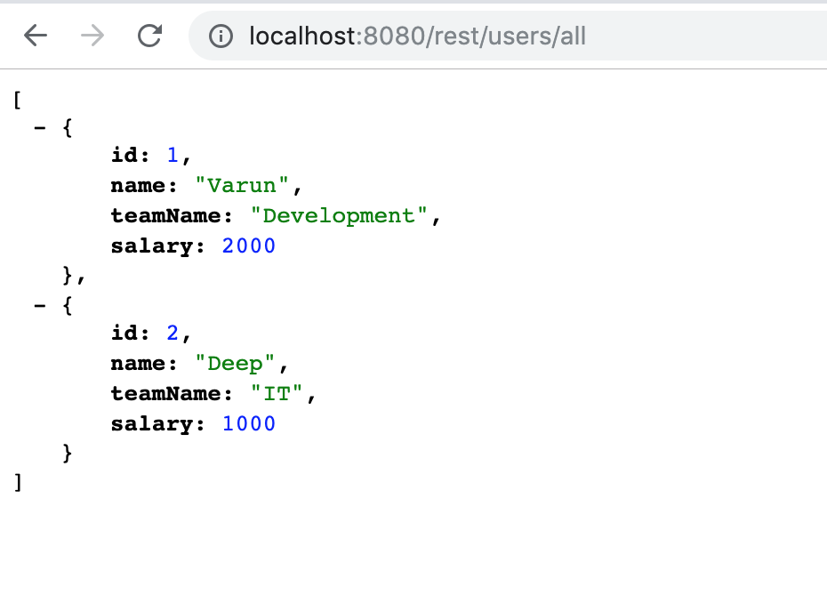

# Spring-Boot-MongoDB-Rest-API
A REST API built using Spring Boot &amp; MongoDB

For MongoDB installation: [MongoDB Install](https://docs.mongodb.com/manual/installation/)

#### Run the project
 - Clone the project on local
    ```$xslt
    git clone https://github.com/varunu28/Spring-Boot-MongoDB-Rest-API
    ```
 - Open the project using IntelliJ 
 - Start MongoDB on local (`data-mongodb` to route MongoDB logs to one folder)
     ```$xslt
    mongod -dbpath=./data-mongodb
    ```
 - Run the `SpringBootMongodbExampleApplication.java`
 - Hit the REST endpoint to fetch all the users from MongoDB database
     ```$xslt
    localost:8080/rest/users/all
    ```
    
#### Output

